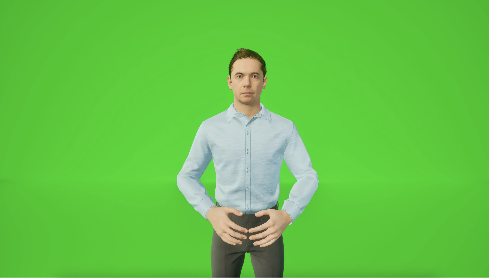

# SignaTurk — Türk İşaret Dili Gerçek Zamanlı İletişim Sistemi

> Bitirme projesi — İşitme engelli bireyler ile işitebilen bireyler arasında gerçek zamanlı, çift yönlü iletişim köprüsü.

---

## Proje Özeti

**SignaTurk**, kameradan alınan görüntüyü işleyerek Türk İşaret Dili (TID) el hareketlerini tanıyan, tanınan kelimeleri ve harfleri ekranda gösteren ve karşı tarafın sesini otomatik olarak metne dönüştüren bir iletişim sistemidir.

Sistem iki yönde çalışır:
- **İşaret → Metin:** Kameradan alınan el hareketleri CNN/LSTM modelleriyle tanınır ve sohbet ekranına yazılır.
- **Ses → Metin:** Karşı tarafın konuşması Faster Whisper ile gerçek zamanlı metne dönüştürülür.

Ek olarak Groq LLM entegrasyonu ile bağlamsal cümle tamamlama desteği sunulmaktadır.

---

## Ekran Görüntüsü



---

## Sistem Mimarisi

```
Kamera → MediaPipe (El Keypoint) → CNN / LSTM Model → Tanınan Kelime / Harf
                                                           ↓
                                              Flask + SocketIO Web Arayüzü
                                                           ↑
Mikrofon → Faster Whisper (STT) → Gerçek Zamanlı Transkripsiyon
```

---

## Kullanılan Teknolojiler

| Katman | Teknoloji |
|---|---|
| El Takibi | MediaPipe Hands |
| Derin Öğrenme | TensorFlow / Keras (CNN + LSTM) |
| Harf Modeli | MobileNetV2 (transfer learning) |
| Ses → Metin | Faster Whisper (`medium`, Türkçe) |
| LLM | Groq API |
| Web Sunucu | Flask + Flask-SocketIO |
| Arayüz | HTML / CSS / JavaScript (Socket.IO) |

---

## Proje Yapısı

```
tsl_project/
├── src/
│   ├── 01_extract_keypoints.py         # Video → .npy keypoint çıkarma (kelimeler)
│   ├── 01_extract_letter_keypoints.py  # Fotoğraf → .npy keypoint çıkarma (harfler)
│   ├── 02_train_model.py               # LSTM model eğitimi (kelime tanıma)
│   ├── 03_evaluate.py                  # Test seti değerlendirme + karışıklık matrisi
│   ├── 04_realtime.py                  # Gerçek zamanlı kelime tanıma (tekil test)
│   ├── 07_collect_my_data.py           # Kişisel harf verisi toplama
│   ├── collect_my_crops.py             # El kırpma verisi toplama
│   ├── tid_server.py                   # Ana uygulama (Flask + SocketIO sunucu)
│   └── templates/
│       └── index.html                  # WhatsApp tarzı sohbet arayüzü
├── voice-dedection-4/
│   ├── swiftkey_stt.py                 # Gerçek zamanlı ses → metin modülü
│   └── requirements.txt               # STT bağımlılıkları
├── models/
│   ├── label_map.json                  # Kelime modeli etiket haritası
│   ├── cnn_label_map.json              # CNN harf modeli etiket haritası
│   ├── landmark_label_map.json         # Landmark modeli etiket haritası
│   ├── landmark_scaler.pkl             # Landmark normalizer
│   ├── landmark_cnn.keras              # Landmark tabanlı CNN modeli
│   ├── best_model.keras                # En iyi LSTM kelime modeli
│   └── model_weights.weights.h5        # LSTM ağırlıkları
│   # best_cnn.keras → Releases sayfasından indirin (30 MB)
├── animations/
│   ├── harfler/                        # A-Z + Türkçe harf animasyonları (.mp4)
│   └── kelimeler/                      # 30 kelime animasyonu (.mp4)
├── test_kurulum.py                     # Kurulum doğrulama scripti
├── requirements.txt                    # Ana bağımlılıklar
├── .env.example                        # Ortam değişkeni şablonu
└── .gitignore
```

---

## Kurulum

### 1. Depoyu klonlayın

```bash
git clone https://github.com/<kullanici-adi>/tsl_project.git
cd tsl_project
```

### 2. Sanal ortam oluşturun

```bash
python -m venv tsl_env
source tsl_env/bin/activate   # macOS / Linux
# tsl_env\Scripts\activate    # Windows
```

### 3. Bağımlılıkları yükleyin

**Apple Silicon (M1/M2/M4):**
```bash
pip install tensorflow-macos tensorflow-metal
pip install -r requirements.txt
```

**Diğer sistemler:**
```bash
pip install -r requirements.txt
```

### 4. Ortam değişkenlerini ayarlayın

```bash
cp .env.example .env
# .env dosyasını açıp GROQ_API_KEY değerini girin
```

Groq API anahtarı için: [https://console.groq.com](https://console.groq.com) (ücretsiz)

### 5. Kurulumu doğrulayın

```bash
python test_kurulum.py
```

---

## Model Dosyaları

| Dosya | Boyut | Durum |
|---|---|---|
| `models/landmark_cnn.keras` | 1.5 MB | Repoda mevcut |
| `models/best_model.keras` | 5.4 MB | Repoda mevcut |
| `models/model_weights.weights.h5` | 5.3 MB | Repoda mevcut |
| `models/best_cnn.keras` | 30 MB | **Releases sayfasından indirin** |

> `best_cnn.keras` boyutu nedeniyle repoya dahil edilmemiştir.
> GitHub Releases sayfasından `models/` klasörüne indirin, ardından uygulamayı başlatın.

---

## Kullanım

### Ana uygulama (tam özellikli)

```bash
cd src
python tid_server.py
```

Tarayıcıda açın: `http://localhost:5000`

### Sadece kelime tanıma testi

```bash
cd src
python 04_realtime.py
```

---

## Pipeline — Sıfırdan Eğitmek İsterseniz

Kendi verinizi kullanarak modeli yeniden eğitmek için adımları sırayla çalıştırın:

```bash
# 1. Video verisinden keypoint çıkarma
python src/01_extract_keypoints.py

# 2. Model eğitimi
python src/02_train_model.py

# 3. Test seti değerlendirme
python src/03_evaluate.py
```

**Veri klasörü yapısı** (`data/` dizini — `.gitignore`'da, repoya dahil değil):
```
data/raw_videos/
  Train/kelime/signer{N}_sample{N}_color.mp4
  Test/kelime/...
  Val/kelime/...
```

---

## Desteklenen Kelimeler

30 kelime + Türk alfabesinin tüm harfleri (A-Z, Ç, Ğ, İ, Ö, Ş, Ü):

`anne · baba · ben · sen · onlar · ev · okul · iyi · evet · hayır · tamam · selam · hoşçakal · teşekkür · yardım · sevmek · beklemek · yapmak · çalışmak · kaçmak · memnun olmak · neden · nerede · dolu · dün · saat · telefon · alışveriş · şampiyon · çocuk`

---

## Özellikler

- **Çift yönlü iletişim:** İşaret → metin ve ses → metin aynı anda
- **WhatsApp tarzı arayüz:** Sohbet baloncukları, gerçek zamanlı güncelleme
- **Animasyon desteği:** Tanınan kelime/harf için TID animasyonu gösterimi
- **Gürültü engelleme:** Motion detection + çoklu onay + güven eşiği
- **LLM entegrasyonu:** Groq API ile bağlamsal cümle tamamlama
- **Apple Silicon uyumlu:** Metal GPU hızlandırma desteği

---

## Gereksinimler

- Python 3.10+
- Kamera (built-in veya USB)
- Mikrofon
- Groq API anahtarı (ücretsiz)
- macOS / Linux (Windows'ta ses modülü için ek yapılandırma gerekebilir)

---

## Lisans

Bu proje akademik amaçlı geliştirilmiştir. Ticari kullanım için lütfen iletişime geçin.
